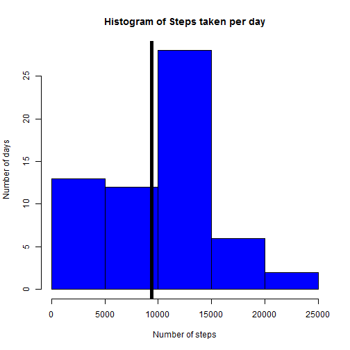
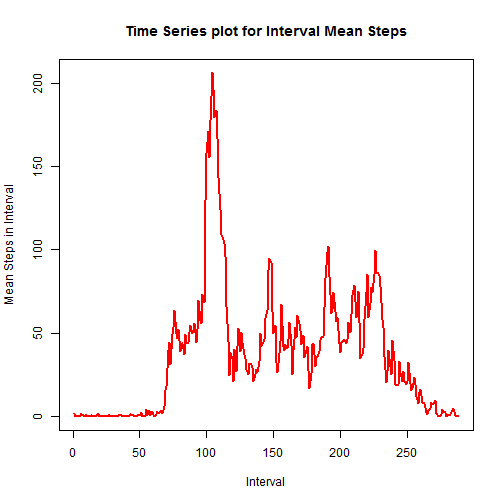
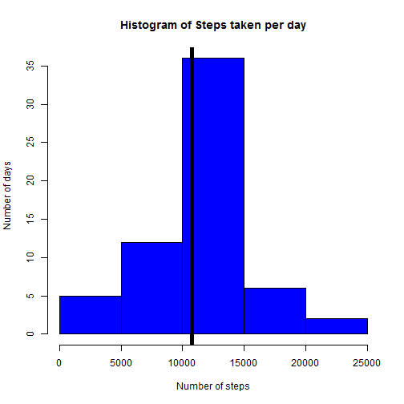
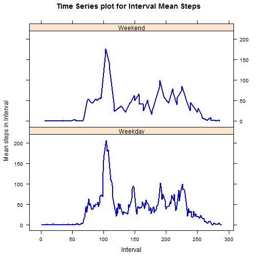

Reproducible Research - Peer Assessment 1
========================================================

Author: S. Begwani

Date: Monday,9th March, 2015


## Introduction

There is a growing group of enthusiasts who engage in self-monitoring physical activity parameters (the so-called "quantified self" movement) using latest, state-of-the-art wearable devices.

For this assigment, we have been provided with a dataset collected from a personal activity monitoring device. The data consists of measurements taken at 5-minute intervals throughout the day from an anonymous individual in the months of October and November, 2012  

## Loading and preprocessing the data

It is assumed that the .csv file containing the data is present in the same working directory as the one containing the Rmd file. 

The following steps are undertaken:

- Reading the original data into a variable called activityData

- Calculating the rows and columns of the data set - the number of rows is expected to be 61x288=17568, where 61 is the number of days in the months of October and November combined, and there are 288 5-minute intervals during the day

- (Not shown in code) Checking that for every day, there are 288 observations, and for every interval, there are 61 observations. This can be done using the table() command - his is to ensure that there are no errors in the data

- Converting the **date** variable from character to Date format
- At this point, we copy the activityData frame to the actData frame.This because we will undertake some transformations, and we want to retain the original data frame

- On the actData frame, **we convert the intervals to HH:MM format strings in 24 hour specification**

- We also **convert the data set to a wide format data set such that each interval is a column** - we use dcast() function from the reshape2 library to do this


```r
activityData <- read.csv("activity.csv")
paste("The number of rows is:", nrow(activityData))
paste("The number of columns is:", ncol(activityData))

## Convert date field from character to Date format

activityData$date <- as.Date(activityData$date, format="%Y-%m-%d")

## Create a copy of the data frame

actData <- activityData

## Convert intervals to HH:MM format
## Please note that the intervals are specified such that the
## interval begininng at 1:00 hrs is 100, not 60

intervals <- actData$interval
convertedTimes <- paste0(formatC(intervals%/%100, width=2, flag="0"),
                         ":", formatC(intervals%%100, width=2, flag="0"))
actData$interval <- convertedTimes

## We now wide-cast the data frame

library(reshape2)

actData <- dcast(actData, date~interval, value.var="steps")
```

```
## [1] "The number of rows is: 17568"
```

```
## [1] "The number of columns is: 3"
```


## Summary values of steps per day and histogram of means

In this section, we calculate the total number of steps taken per day. Then we can calculate the mean and median of the total number of steps. Finally We will then plot a histogram of the number of steps taken per day.

Before we undertake this procedure, it might be instructive to see for which dates are all interval values missing. For these dates, sums will be 0.


```r
## Check which rows(dates) are having only NA values

NAChecker <- !is.na(actData[,-1])
rowNAFull <- which(rowSums(NAChecker)==0)
rowNAFull ## Prints the row numbers with all NA values
```

```
## [1]  1  8 32 35 40 41 45 61
```

```r
actData[[1]][rowNAFull] ## Prints the dates for which values are all NA
```

```
## [1] "2012-10-01" "2012-10-08" "2012-11-01" "2012-11-04" "2012-11-09"
## [6] "2012-11-10" "2012-11-14" "2012-11-30"
```

```r
## Calculate total steps per day, and the mean and median of total steps per day

Totals <- rowSums(actData[,-1], na.rm=TRUE)
paste("The mean number of steps taken per day is:",
      round(mean(Totals),2))
```

```
## [1] "The mean number of steps taken per day is: 9354.23"
```

```r
paste("The median number of steps taken per day is:",
      round(median(Totals),2))
```

```
## [1] "The median number of steps taken per day is: 10395"
```


Next, we construct the histogram, and we observe that on average, the person in the study walked around 9000 steps per day for the period under consideration.


```r
hist(Totals, col="blue", breaks=5,
                   xlab="Number of steps", ylab ="Number of days",
                   main="Histogram of Steps taken per day")
abline (v=mean(Totals), lwd=5, col="black")
```

 


## Average daily activity pattern

In this part of the exercise, we compute the mean values of steps taken in each time period across all days.

Then we will construct a time series plot. For the x-axis of the plot, we will use the numbers 1 to 288 with 1 representing the interval starting at 00:00 hrs, and 288 representing the interval starting at 23:55 hours.


```r
intervalMeans <- colMeans(actData[,-1], na.rm=TRUE)
plot(1:288, intervalMeans, col="red", lwd=2, type="l",
     xlab="Interval", ylab="Mean Steps in Interval", 
     main="Time Series plot for Interval Mean Steps")
```

 

Here, we will also compute the interval containing the highest number of mean steps. 


```r
index <- which.max(intervalMeans)
paste("Interval with highest mean steps is:",colnames(actData)[1+index])

## The above gives the starting point of the interval in HH:MM format
## Since we have drawn the graph considering the intervals in sequence
## marked 1:288, we might be interested in the interval sequence number

paste("Interval sequence (order) with highest mean is:",index)
```

```
## [1] "Interval with highest mean steps is: 08:35"
```

```
## [1] "Interval sequence (order) with highest mean is: 104"
```

As can be seen, the interval of 5 minutes starting at 8:35 AM has the maximum number of mean steps when the mean is calculated across all days in the data set.

## Imputing missing values

Ideally, an imputation should not be performed for days where there is no data, as such an imputation is going to create incorrect interpretations.In an earlier analysis, we see that there are 8 such days where there is no data available.

However, for this exercise, it might be advisable not to discard any part of the data set. For each of the intervals, it is seen that there is at least one value present which is not NA. We impute missing values in a column by setting them to the mean of the column. 

In the imputed data set, totals for those dates where there are any NA values will go up. This implies the mean of the total number of steps also goes up.

As for the median, there are 8 days for which there is no data. The total of the values for each of these days will be the same after imputation. It is observed that the median value after imputation equals to this common value. Also, the median with imputed values is higher than the median without imputation.


```r
## Print the number of NAs in the original data set

paste("The total NAs in the original data set is:",
      sum(is.na(activityData)))

## We now create a new data set where we will impute values

imputedData <- actData

imputeFunction <- function(x)
{
  x[is.na(x)] <- mean(x, na.rm=TRUE)
  return(x)
}

imputedData[,2:ncol(imputedData)] <- lapply(imputedData[,-1],imputeFunction)

## Calculate totals, means and medians for the imputed data set

Totals <- rowSums(imputedData[,-1])

paste("The mean number of steps taken per day is:", 
      round(mean(Totals),2))
paste("The median number of  taken per day is:", 
      round(median(Totals),2))
```

```
## [1] "The total NAs in the original data set is: 2304"
```

```
## [1] "The mean number of steps taken per day is: 10766.19"
```

```
## [1] "The median number of  taken per day is: 10766.19"
```

We can now plot a histogram of the total steps per day based on the imputed values. We can see that, on average, the total number of steps per day has gone up to around 11000 (it was around 9000 earlier without imputation)


```r
hist(Totals, col="blue", breaks=5,
                   xlab="Number of steps", ylab ="Number of days",
                   main="Histogram of Steps taken per day")
abline (v=mean(Totals), lwd=5, col="black")
```

 


## Activity Patterns on Weekdays and Weekends

To calculate the day of the week, we will use the wday() function from the lubridate package. This function takes a date returns a value of 1 for Sunday and 7 for Saturday which are the weekends.

The illustrative graph shown in the exercise for this part is a lattice plot. A lattice plot is constructed below:


```r
library(lubridate)

## Adding a variable for day of the week
weekdayVector <- ifelse(wday(imputedData$date) %in% c(1,7),
                        "Weekend", "Weekday")
imputedData$DayofWeek <- as.factor(weekdayVector)

##Calculate interval mean number of steps

intervalMeans <- colMeans(imputedData[,-c(1,ncol(imputedData))])
intervalNumber <- 1:288

## Load the lattice library and produce the plots

library(lattice)
xyplot(intervalMeans~intervalNumber | DayofWeek, data=imputedData,
       layout = c(1,2), type="l", col="blue", lwd=2,
       xlab="Interval",ylab="Mean steps in Interval",
       main="Time Series plot for Interval Mean Steps")
```

 


